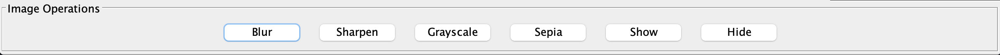

# USEME

To run the program, either double-click the JAR file, or open a terminal and navigate to the folder
it's in. Then from there, enter `java -jar image-processor.jar -interactive` if you wish to open 
the interactive GUI, `java -jar image-processor.jar -text` if you wish to open an 
interactive text mode, and `java -jar image-processor.jar -script [path-of-script-file]` if you wish
to run a script file.

Commands supported by the Image Processor program:

1. `create [layer name] [layer image]`

   Creates a new layer with the name and the image. Image can either be a generated checkerboard or
   an added image:

    ```
    create first add res/desert.ppm ppm
   
   or

    create first checkerboard 5 5 0 0 0 255 255 255
    ```


2. `checkerboard [rows] [columns] [r] [g] [b] [r] [g] [b]` - only used in `create`

   Generates a checkerboard image:

    ```
    create cb checkerboard 5 5 0 0 0 255 255 255
    ```


3. `add [file directory] [file type]` - only used in `create`:

   Adds an image:

    ```
    create desert add res/desert.ppm ppm
    ```

4. `remove [layer name]` - Removes the layer with given ID:

    ```
    create first add res/desert.ppm ppm
    remove first
    ```

4. `current [layer name]` - Sets the given layer as the current layer:

    ```
    create first add res/desert.ppm ppm
    current first
    ```

5. `blur` - blurs the current layer:

    ```
    create first add res/desert.ppm ppm
    current first
    blur
    ```

6. `sharpen` - sharpens the current layer:

    ```
    create first add res/desert.ppm ppm
    current first
    sharpen
    ```

7. `grayscale` - grayscales the current layer:

    ```
    create first add res/desert.ppm ppm
    current first
    grayscale
    ```

8. `sepia` - sepia the current layer:

    ```
    create first add res/desert.ppm ppm
    current first
    sepia
    ```

9. `show` - makes the current layer visible, only if it is hidden:

    ```
    create first add res/desert.ppm ppm
    current first
    hide
    show
    ```

10. `hide` - makes the current layer invisible, only if it is visible:

    ```
    create first add res/desert.ppm ppm
    current first
    hide
    ```

11. `save [type] [file directory]` - saves the topmost visible layer as an image with the file types
    of PNG, JPEG, and PPM. Paths do not need file extensions:

    ```
    create first add res/desert.ppm ppm
    create second add res/desert.ppm ppm
    current second
    hide
    save png res/oneLayerDesert #this is the "first" layer as it is topmost and visible
    ```

12. `saveall [type] [file directory]` - saves all of the layers into images of the given file type
    and creates a text file representing the whole image with the given file name. This and the
    images are then put into a folder. Paths do not need file extensions:

    ```
    create first add res/desert.ppm ppm
    create second add res/desert.ppm ppm
    saveall jpeg res/twoLayerDesert
    ```


13. `addmulti [file directory]` - Adds a new multi layer image from the given text file and replaces
    the currernt multi layer with this one:

    ```
    create first add res/desert.ppm ppm
    create second add res/desert.ppm ppm
    addmulti res/bugs/bugs.txt
    ```
    
&nbsp;

## Using the GUI

Instructions on how to use the interactive GUI for this program:

&nbsp;

### Buttons:



There are 6 buttons at the bottom of the main menu which handle the filters, transformations, 
and basic layer operations. A layer must be added and selected before these can be used.

&nbsp;

### Image Display:


In the center is where the image you add is displayed. This will display any images you wish to add,
and any filters or transformations you apply. All layer operations will also be visible here,
including showing, hiding, deleting, adding layers, etc.

Example Display:


&nbsp;

### Layer Menu:


On the right side of the main menu, there is a menu which displays all the layers.
These blocks are selectable via click, and once clicked you are able to apply any layer/image
operations that you wish. When a layer is selected, it will be outlined in red as shown.

&nbsp;

### Menu Bar:


Shown is the menu bar that is displayed at the top of the GUI.
These contain the submenus shown below:


